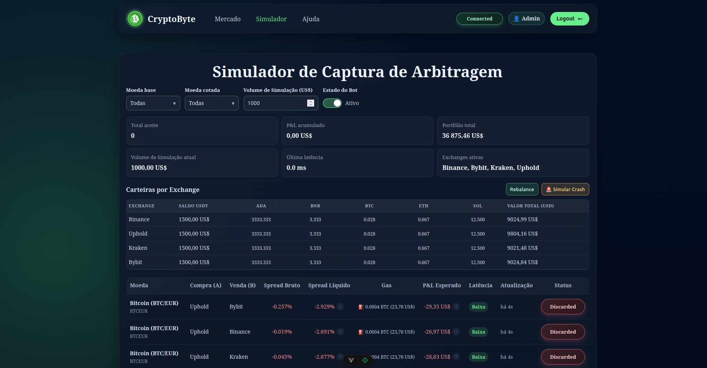
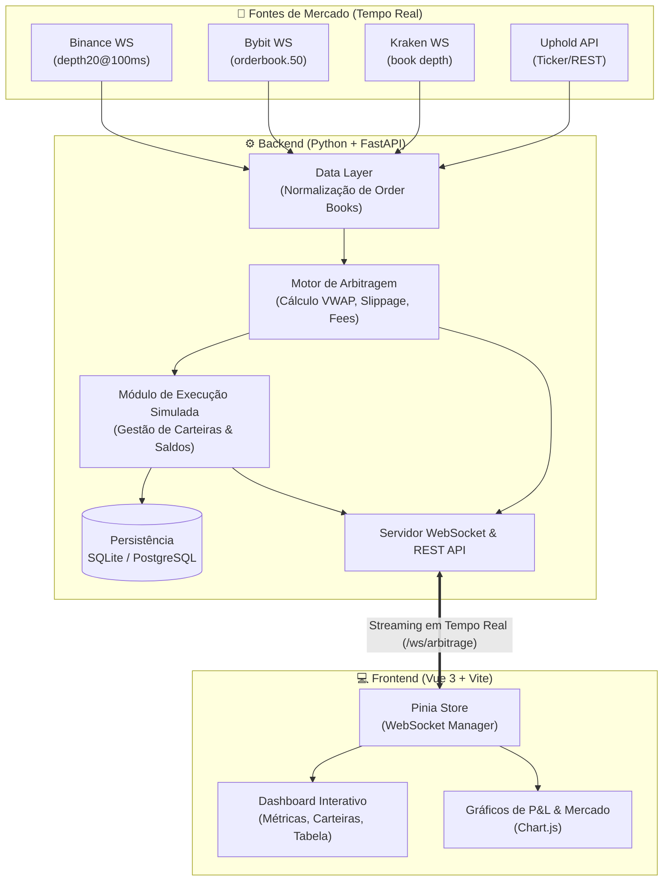

# ⚡ BUGSBYTE 2026

> **Sistema Inteligente de Simulação e Monitorização de Arbitragem de Criptomoedas em Tempo Real**

[](https://fastapi.tiangolo.com/)
[](https://python.org)
[](https://vuejs.org/)
[](https://www.typescriptlang.org/)
[](https://vitejs.dev/)
[](https://www.sqlite.org/)

---

## 👥 Equipa de Desenvolvimento

| Nome 
| :--
| **Guilherme Gomes** 
| **João Cerqueira** 
| **Nuno Pereira** 
| **Rafael Esteves** 

---

## 📖 O que é este projeto?

**CRYPTOBYTE 2026** é uma plataforma completa (Full-Stack) desenhada para **detetar, calcular e simular em tempo real oportunidades de arbitragem entre diferentes bolsas de criptomoedas (*exchanges*)**.

### 🤔 O que é Arbitragem de Criptomoedas?
Em mercados financeiros descentralizados, o mesmo ativo (por exemplo, **Bitcoin**) pode estar a ser transacionado a preços ligeiramente diferentes em corretoras distintas ao mesmo segundo:
* Exemplo: O Bitcoin está a **$60.000** na **Binance** (preço de venda/Ask) e a **$60.150** na **Kraken** (preço de compra/Bid).
* Um operador de arbitragem compra instantaneamente na Binance e vende na Kraken, obtendo um lucro bruto de **$150**.

### ⚠️ O Desafio Real: Porque é que a arbitragem simples falha?
No mundo real, a maioria das ferramentas comete o erro de olhar apenas para o "topo do livro de ordens" e ignorar custos ocultos. Uma operação que parece lucrativa pode gerar prejuízo devido a:
1. **Taxas da Corretora (*Trading Fees*)**: Cada compra e venda paga comissões (ex.: 0.1% a 0.26%).
2. **Custo de Transferência na Rede (*Network / Gas Fees*)**: Custos fixos de transação entre carteiras e exchanges.
3. **Liquidez e Profundidade (*Order Book Depth*)**: Se quisermos comprar 1 BTC mas só existirem 0.1 BTC ao preço mais baixo, teremos de comprar o restante a preços mais caros (*Slippage*).

### 💡 A Solução BUGSBYTE
**CRYPTOBYTE 2026** resolve isto através de um **Motor de Cálculo Realista em Python**:
* Analisa a **profundidade real dos livros de ordens (L2 Order Books)** em milissegundos.
* Calcula o **VWAP (*Volume-Weighted Average Price*)** com base no volume simulado exato.
* Deduz **taxas específicas de cada exchange** e **custos de rede estimados**.
* Simula a **execução instantânea com gestão de carteiras** (saldos em USDT/EUR e cripto), prevenindo o consumo repetido de liquidez já utilizada.

---

## 📸 Interface do Utilizador (Dashboard)

Abaixo está o painel principal do simulador em tempo real:



### 🧭 O que estamos a ver no ecrã?
1. **Barra Superior (Navbar)**:
   * **Indicador de Conexão WebSocket**: Ponto verde indicando fluxo de dados ao vivo em milissegundos.
   * **Navegação & Perfil**: Acesso rápido a *Home*, *Simulador*, *Mercado*, *Ajuda* e sessão do utilizador.
2. **Filtros e Controlo do Bot**:
   * **Moeda Base / Cotada**: Seleção dinâmica de pares (ex: `BTC`, `ETH`, `SOL`, `BNB`, `ADA` contra `USDT`, `EUR`, `USD` ou pares cruzados).
   * **Volume de Simulação ($)**: Permite ajustar o valor financeiro da ordem para testar o impacto de *slippage* em volumes pequenos vs. grandes.
   * **Bot Automático (ON/OFF)**: Liga ou desliga a execução simulada automática das ordens lucrativas.
   * **Botão Rebalancear**: Distribui os saldos uniformemente entre as exchanges para continuar a simulação.
3. **Cartões de Métricas Globais**:
   * **Total de Trades**: Número de operações lucrativas executadas com sucesso.
   * **P&L Acumulado (*Profit & Loss*)**: Lucro líquido total obtido até ao momento.
   * **Portfólio Total**: Património total consolidado em dólares/euros.
   * **Latência**: Tempo de processamento e deteção da oportunidade mais recente.
   * **Exchanges Ativas**: Número de feeds em streaming simultâneo.
4. **Distribuição de Carteiras por Exchange**:
   * Saldos independentes para **Binance**, **Bybit**, **Kraken** e **Uphold**, demonstrando transferências e reservas de capital em tempo real.
5. **Tabela Dinâmica de Oportunidades**:
   * Visualização com paginação e estados: `ACCEPTED` (executada com lucro), `DISCARDED` (sem lucro após taxas), `NO_FUNDS` (sem saldo suficiente) ou `LOW_LIQUIDITY`.
   * Detalhes de Spread Bruto vs. Líquido, taxas de rede e exchanges envolvidas.
6. **Gráficos em Tempo Real**:
   * Evolução histórica do P&L e dispersão de spreads ao longo do tempo.

---

## 🏗️ Arquitetura do Sistema

O sistema é construído segundo uma arquitetura orientada a eventos, dividida em duas camadas principais comunicando via **WebSockets bidirecionais** e **REST API**:


```mermaid
flowchart TD
    subgraph Feeds ["📡 Fontes de Mercado (Tempo Real)"]
        BN["Binance WS\n(depth20@100ms)"]
        BB["Bybit WS\n(orderbook.50)"]
        KR["Kraken WS\n(book depth)"]
        UP["Uphold API\n(Ticker/REST)"]
    end

    subgraph Backend ["⚙️ Backend (Python + FastAPI)"]
        DL["Data Layer\n(Normalização de Order Books)"]
        ENG["Motor de Arbitragem\n(Cálculo VWAP, Slippage, Fees)"]
        SIM["Módulo de Execução Simulada\n(Gestão de Carteiras & Saldos)"]
        DB[(Persistência\nSQLite / PostgreSQL)]
        WS_SRV["Servidor WebSocket & REST API"]
    end

    subgraph Frontend ["💻 Frontend (Vue 3 + Vite)"]
        PINIA["Pinia Store\n(WebSocket Manager)"]
        DASH["Dashboard Interativo\n(Métricas, Carteiras, Tabela)"]
        CHART["Gráficos de P&L & Mercado\n(Chart.js)"]
    end

    BN & BB & KR & UP --> DL
    DL --> ENG
    ENG --> SIM
    SIM --> DB
    ENG & SIM --> WS_SRV
    WS_SRV <== "Streaming em Tempo Real (/ws/arbitrage)" ==> PINIA
    PINIA --> DASH & CHART
```

---

## ✨ Principais Funcionalidades

### ⚙️ Backend (FastAPI + Async Python)
* **Ingestão Assíncrona de Alta Velocidade**: Feeds via WebSockets de exchanges de topo (Binance, Bybit, Kraken) e tickers via polling otimizado (Uphold).
* **Motor Matemático Avançado**:
  * Cálculo de spread bruto vs. líquido deduzindo taxas de Maker/Taker configuráveis por exchange.
  * Algoritmo de **VWAP** que consome múltiplos níveis do livro de ofertas para refletir slippage real.
  * Estimativa dinâmica de custos de rede (*Gas fee*) por ativo.
* **Simulador de Execução com Livro de Ordens Dinâmico**: Consumo e reserva de volume para evitar re-execuções irreais no mesmo snapshot de liquidez.
* **Injeção de Eventos Demo (*Crash Simulation*)**: Endpoint para simular quedas bruscas de preço numa exchange para demonstrar arbitragem instantânea em apresentações/testes.
* **Persistência Híbrida**: Memória para latência ultrabaixa + persistência assíncrona em **SQLite** (por defeito) ou **PostgreSQL** via SQLAlchemy.

### 🎨 Frontend (Vue 3 + TypeScript + Vite + Pinia)
* **Dashboard em Tempo Real**: Atualizações reativas sem necessidade de refresh na página graças à store centralizada de WebSocket.
* **Sistema de Autenticação**: Login com persistência de sessão e proteção de rotas privadas.
* **Módulo de Mercado**: Gráficos com dados históricos de mercado via CoinGecko / Binance Klines.
* **Página de Ajuda e FAQs**: Explicações integradas sobre métricas financeiras, spreads e terminologia do projeto.
* **Interface Moderna e Responsiva**: Componentes com animações fluídas, feedback visual de ordens e temas de alto contraste para trading.

---

## 🚀 Como Executar o Projeto

Podes iniciar o projeto de duas formas: através do **Makefile** (recomendado para Linux/macOS) ou **manualmente passo a passo**.

### 📋 Pré-requisitos
* **Node.js** (versão 18 ou superior) e **npm**
* **Python** (versão 3.10 ou superior) com `python3-venv` instalado

No Ubuntu / Debian / Linux Mint:
```bash
sudo apt update
sudo apt install nodejs npm python3 python3-venv
```

---

### Método 1: Inicialização Rápida via Makefile (Recomendado)

Na raiz do repositório, podes controlar todo o ambiente com comandos simples:

```bash
# 1. Iniciar o backend em background (cria o venv e instala dependências automaticamente)
make backend-on

# 2. Iniciar o frontend interativo
make site
```

Outros comandos úteis do Makefile:
* `make backend-status` : Verifica se o backend está ativo e qual o PID do processo.
* `make backend-off`    : Desliga o backend com segurança e limpa a base de dados SQLite temporária.
* `make help`           : Mostra todos os comandos disponíveis.

---

### Método 2: Execução Manual Passo a Passo

#### 1️⃣ Iniciar o Backend

Abra um terminal e execute:

```bash
# Entrar na pasta do backend
cd backend

# Criar e ativar o ambiente virtual Python
python3 -m venv .venv
source .venv/bin/activate

# Instalar dependências
pip install -r requirements.txt

# Iniciar o servidor FastAPI
uvicorn app.main:app --reload --port 8000
```
> O backend estará a correr em: **`http://localhost:8000`**  
> Documentação interativa da API (Swagger): **`http://localhost:8000/docs`**

#### 2️⃣ Iniciar o Frontend

Abra um **segundo terminal** na raiz do projeto e execute:

```bash
# Instalar dependências do Node.js
npm install

# Iniciar o servidor de desenvolvimento Vite
npm run dev
```
> O frontend estará disponível em: **`http://localhost:5173`**

---

## 🔑 Como Utilizar a Aplicação

1. **Aceder à Aplicação**: Abra o browser em `http://localhost:5173`.
2. **Autenticação**: Faça login na página inicial (suporta credenciais de teste ou novo registo local).
3. **Explorar o Simulador**:
   * Observe a luz verde de WebSocket na navbar indicando dados em direto.
   * Altere a moeda de teste (ex: `BTC`, `ETH`, `SOL`) e o volume financeiro.
   * Veja o bot a detetar oportunidades e a executar trades lucrativas no gráfico de P&L.
   * Use o botão **Rebalancear** caso queira redistribuir os saldos de simulação entre as corretoras.
4. **Ver Dados de Mercado**: Visite a aba **Mercado** para inspecionar gráficos históricos de preços de diferentes criptoativos.

---

## 🔌 Endpoints da API REST & WebSockets

| Método | Rota | Descrição |
| :--- | :--- | :--- |
| `GET` | `/` | Informações de saúde e versão do serviço |
| `GET` | `/health` | Healthcheck simples da API |
| `GET` | `/api/arbitrage/status` | Snapshot completo do estado atual (saldos, P&L, feeds ativos) |
| `GET` | `/api/arbitrage/opportunities` | Lista oportunidades detetadas (aceites e descartadas) com filtros |
| `GET` | `/api/arbitrage/trades` | Histórico de todas as execuções de arbitragem simuladas |
| `GET` | `/api/arbitrage/spread-series` | Série temporal dos spreads bruto e líquido e latência |
| `GET` | `/api/arbitrage/bot-status` | Verifica se a execução automática do bot está ligada |
| `POST` | `/api/arbitrage/bot-control` | Liga ou desliga o bot de trading automático (`{"enabled": true/false}`) |
| `POST` | `/api/arbitrage/simulation-volume` | Ajusta o volume financeiro em USD utilizado no cálculo do VWAP |
| `POST` | `/api/arbitrage/rebalance` | Rebalanceia os saldos de USDT/EUR entre todas as corretoras |
| `POST` | `/api/arbitrage/demo-crash` | Simula uma queda de preço artificial para demonstração ao vivo |
| `GET` | `/api/market/history` | Dados históricos de preços (integração CoinGecko / Binance) |
| `WS` | `/ws/arbitrage` | **Canal WebSocket de Streaming** contínuo de métricas e spreads |

---

## ⚙️ Configuração Personalizada

As configurações operacionais do motor de arbitragem podem ser ajustadas em [`backend/config.json`](backend/config.json):

```json
{
  "symbol": "BTCEUR",
  "symbols": [
    "BTCEUR", "BTCUSD", "BTCUSDT",
    "ETHEUR", "ETHUSD", "ETHUSDT",
    "SOLEUR", "SOLUSD", "SOLUSDT",
    "BNBEUR", "BNBUSD", "BNBUSDT",
    "ADAEUR", "ADAUSD", "ADAUSDT"
  ],
  "trade_size": 0.05,
  "transfer_cost_usd": 1.0,
  "starting_balance_usd": 10000,
  "auto_simulate_execution": true,
  "opportunity_threshold_usd": 0.01,
  "feeds": [
    { "name": "Binance", "kind": "binance_ws", "fee": 0.001, "enabled": true },
    { "name": "Uphold", "kind": "uphold_ticker", "fee": 0.002, "enabled": true },
    { "name": "Kraken", "kind": "kraken_ws", "fee": 0.0026, "enabled": true },
    { "name": "Bybit", "kind": "bybit_ws", "fee": 0.001, "enabled": true }
  ]
}
```

* **`starting_balance_usd`**: Saldo inicial da simulação distribuído pelas carteiras.
* **`opportunity_threshold_usd`**: Lucro líquido mínimo em USD para que uma oportunidade seja classificada como `ACCEPTED`.
* **`fee`**: Taxa de comissão por ordem em cada exchange.
* **`transfer_cost_usd`**: Custo base de transferência de rede entre carteiras.

---

## 📂 Estrutura do Repositório

```text
BUGSBYTE-2026/
├── backend/                        # Servidor e Motor de Arbitragem em Python
│   ├── app/
│   │   ├── config.py               # Leitura e validação de configurações
│   │   ├── db.py                   # Conexão e modelos de base de dados (SQLAlchemy)
│   │   ├── engine.py               # Motor principal: cálculo de VWAP, spreads e carteiras
│   │   ├── main.py                 # Aplicação FastAPI, rotas REST e WebSockets
│   │   ├── market_data.py          # Conectores WebSocket/REST para Binance, Bybit, Kraken, Uphold
│   │   ├── models.py               # Estruturas de dados e serialização de DTOs
│   │   ├── persistence.py          # Gravação assíncrona de trades e oportunidades
│   │   └── service.py              # Gestão do ciclo de vida e orquestração do serviço
│   ├── data/                       # Diretório local para a base de dados SQLite
│   ├── config.json                 # Ficheiro de parametrização do motor e exchanges
│   └── requirements.txt            # Dependências Python (FastAPI, uvicorn, websockets, etc.)
│
├── src/                            # Aplicação Frontend em Vue 3 + TypeScript
│   ├── components/
│   │   ├── ArbitrageSimulationPanel.vue # Painel interativo de simulação e gráficos
│   │   └── CustomSelect.vue        # Componente de seleção customizado
│   ├── pages/
│   │   ├── Home.vue                # Página inicial de apresentação
│   │   ├── Login.vue               # Página de autenticação do utilizador
│   │   ├── Main.vue                # Wrapper para o dashboard principal
│   │   ├── Market.vue              # Página de histórico de preços de mercado
│   │   └── Help.vue                # Documentação interna e central de ajuda
│   ├── router/                     # Rotas da aplicação (Vue Router)
│   ├── services/                   # Serviços de comunicação HTTP com a API
│   ├── stores/                     # Gestão de estado reativo global (Pinia)
│   │   └── websocket.ts            # Store do WebSocket para broadcast em tempo real
│   ├── App.vue                     # Componente raiz da aplicação
│   └── main.ts                     # Ponto de entrada do frontend
│
├── docs/                           # Recursos visuais e capturas de ecrã
│   └── simulator-screenshot.png    # Imagem da interface do simulador
│
├── Makefile                        # Automação de tarefas (iniciar/desligar serviços)
├── package.json                    # Dependências e scripts do Frontend (Vite, Vue, Pinia)
└── README.md                       # Documentação principal do projeto
```

---

## 🛠️ Tecnologias e Ferramentas Utilizadas

### 🖥️ Frontend
* **[Vue.js 3](https://vuejs.org/)** (Composition API, `<script setup>`)
* **[TypeScript](https://www.typescriptlang.org/)** para tipagem estática e segurança de código
* **[Vite](https://vitejs.dev/)** para compilação ultrarrápida e Hot Module Replacement (HMR)
* **[Pinia](https://pinia.vuejs.org/)** para gestão de estado reativo global
* **[Vue Router](https://router.vuejs.org/)** para navegação fluída SPA (*Single Page Application*)
* **[Chart.js](https://www.chartjs.org/)** para renderização de gráficos financeiros interativos

### ⚙️ Backend
* **[Python 3.10+](https://www.python.org/)**
* **[FastAPI](https://fastapi.tiangolo.com/)** para endpoints REST assíncronos de alta performance
* **[WebSockets](https://websockets.readthedocs.io/)** para transmissão bidirecional em tempo real
* **[SQLAlchemy](https://www.sqlalchemy.org/)** com suporte a operações assíncronas
* **[SQLite](https://www.sqlite.org/)** / **[PostgreSQL](https://www.postgresql.org/)** para persistência de dados
* **[Uvicorn](https://www.uvicorn.org/)** como servidor ASGI de produção

---

## 📄 Licença

Projeto desenvolvido no âmbito académico para o ano letivo de 2025/2026. Todos os direitos reservados à respetiva equipa de desenvolvimento.
